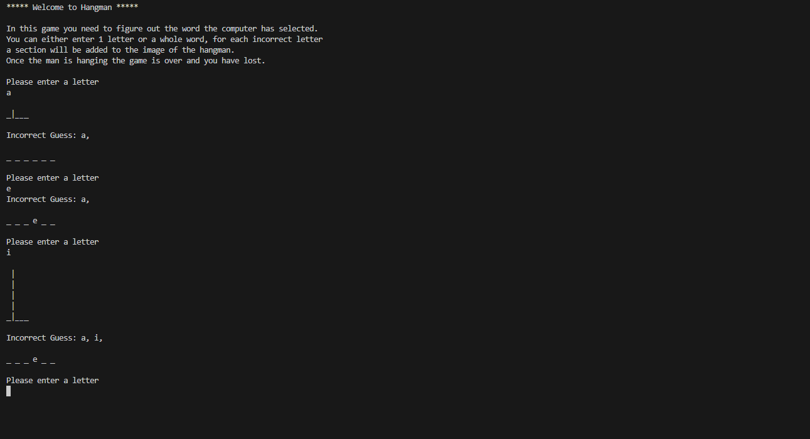
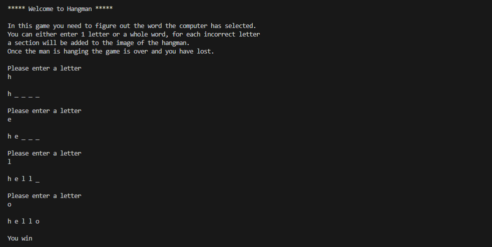
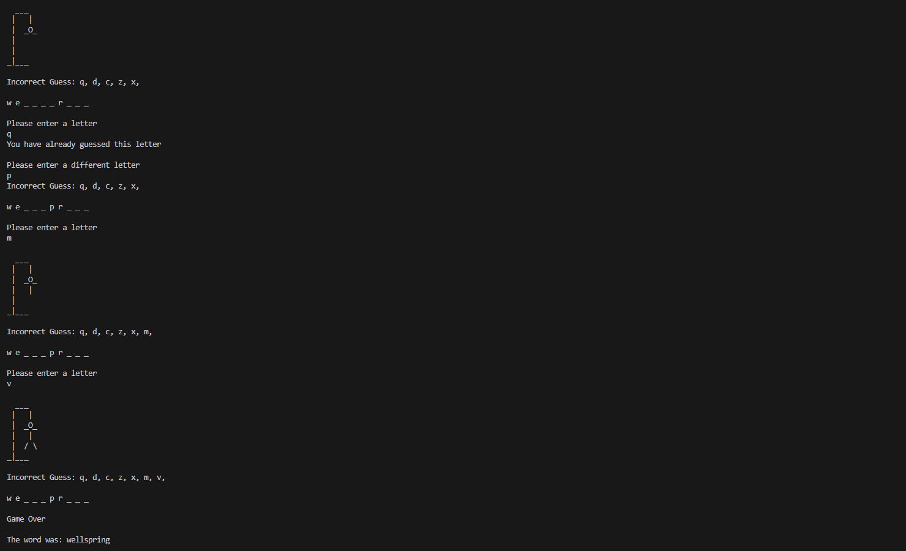

# Hangman CLI Game

This is a small Java project to get back in the swing of using Java.

## Table of Contents

- [Snippets](#snippets)
- [Tech Stack](#tech-stack)
- [Requirements](#requirements)
  - [MVP](#mvp)
- [Known Issues](#known-issuses)
- [Future Goals](#future-goals)

## Snippets

- Upon starting the game a word is selected from a list and the length is displayed. You can then input letters.
   
  

- If you guess the word correctly before the hangman is built you have won.
   
  

- If the hangman is built before you guess the correct word then the Game will end and you have lost.
   
  

## Tech Stack

- Java

## Requirements

### MVP

- Recreate a version of the game Hangman to be played in a Java console application.
- The game should randomly select a word from the provided list.
- When the word is selected, a row of underscores representing letters in the word should be printed to the console.
- The user should be able to guess wrong 7 times before they loose
- They should be given the option to guess a letter or the whole word

## Known Issues

- If you enter multiple letters it does not detect it properly.

## Future Goals

- Allow users to input whole words as well as letters.
